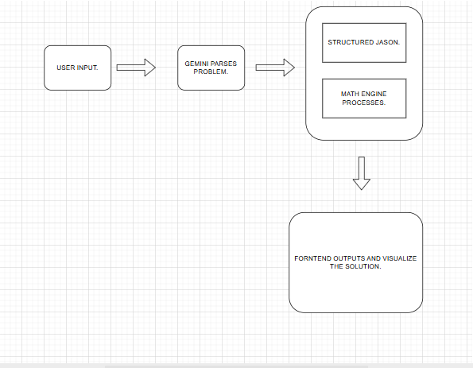

# GEOMETRY Project - 1st MVP

GEOMETRY is a natural-language geometry solving application. It accepts geometry word problems, converts them into structured mathematical intent, solves them through the backend Geometry Math Engine, and visualizes the result in 2D or 3D.

The MVP focuses on reliable semantic routing: the system must solve the operation the user actually requested, not a simpler related operation. For example, a cylinder volume problem must not be solved as circle area, and a cone height/volume problem must not be reduced to a final Pythagorean triangle answer.

## Architecture



```text
User question
-> Gemini interpretation provider
-> structured semantic problem / operation JSON
-> backend validation and solution planning
-> Geometry Math Engine
-> authoritative result
-> explanation builder
-> visualization adapter
-> React frontend
-> Canvas 2D or Three.js 3D visualization
```

### Backend Responsibilities

- Receive direct operation requests or natural-language word problems.
- Use Gemini only to interpret the user's geometry intent.
- Normalize parsed data into supported backend operation names and parameters.
- Validate operation compatibility, required parameters, and geometry constraints.
- Use the Geometry Math Engine as the authoritative calculation layer.
- Build student-friendly explanations.
- Produce visualization payloads for the frontend.

### Frontend Responsibilities

- Provide the chat-style solving interface.
- Display final results and structured explanations.
- Render 2D diagrams with Canvas.
- Render 3D geometry with Three.js.
- Never calculate authoritative mathematical answers.

## Tech Stack

### Backend

- Python
- Django
- Django REST Framework
- Google GenAI SDK for Gemini interpretation
- python-dotenv for local environment configuration
- NumPy and SciPy for advanced math-engine modules
- SQLite for local development

### Frontend

- React
- Vite
- Three.js
- KaTeX / react-katex
- Playwright for frontend visual smoke tests

## Project Structure

```text
.
|-- Backend/
|   |-- .env
|   `-- geometry/
|       |-- manage.py
|       |-- geometry/
|       `-- euclidean/
|           |-- Math_Engine/
|           |-- parser/
|           |-- solver/
|           |-- explanations.py
|           `-- views.py
|-- Frontend/
|   |-- package.json
|   `-- src/
|       |-- components/
|       `-- services/
|-- assets/
|   `-- Geo.png
`-- README.md
```

## Prerequisites

Install these before running the project:

- Python 3.12 or newer
- Node.js 20 or newer
- npm
- A valid Gemini API key

## Backend Setup

From the repository root:

```powershell
cd Backend
python -m venv .venv
.\.venv\Scripts\Activate.ps1
python -m pip install --upgrade pip
python -m pip install django djangorestframework google-genai python-dotenv numpy scipy
```

This repository currently does not include a committed `requirements.txt`. If one is added later, prefer:

```powershell
python -m pip install -r requirements.txt
```

Create or update `Backend/.env`:

```env
GEMINI_API_KEY=your_gemini_api_key
GEMINI_PRIMARY_MODEL=gemini-3.6-flash
GEMINI_FALLBACK_MODEL=gemini-3.5-flash
LLM_FALLBACK_ENABLED=false
DJANGO_DEBUG=True
DJANGO_ALLOWED_HOSTS=localhost,127.0.0.1,testserver
```

Do not commit real API keys.

Run database migrations:

```powershell
cd Backend\geometry
python manage.py migrate
```

Start the backend server:

```powershell
python manage.py runserver 127.0.0.1:8000
```

Backend health check:

```text
http://127.0.0.1:8000/api/health/
```

## Frontend Setup

Open a second terminal from the repository root:

```powershell
cd Frontend
npm install
npm run dev
```

The frontend will usually run at:

```text
http://127.0.0.1:5173/
```

## Running the Full Project

Use two terminals.

Terminal 1 - backend:

```powershell
cd Backend\geometry
python manage.py runserver 127.0.0.1:8000
```

Terminal 2 - frontend:

```powershell
cd Frontend
npm run dev
```

Then open:

```text
http://127.0.0.1:5173/
```

## Testing

Run backend tests:

```powershell
cd Backend\geometry
python manage.py test euclidean
```

Run Django system checks:

```powershell
cd Backend\geometry
python manage.py check
```

Build the frontend:

```powershell
cd Frontend
npm run build
```

Run the Playwright visual smoke tests:

```powershell
cd Frontend
npx playwright test phase3.visual.spec.js
```

If Playwright browsers are not installed yet:

```powershell
cd Frontend
npx playwright install
```

## Supported MVP Operation Areas

The current MVP supports a growing set of Euclidean and analytical geometry operations, including:

- distance between two points
- midpoint
- slope
- circle area and circumference
- circle-circle intersection
- triangle area, perimeter, and missing angle
- Pythagorean theorem
- rectangle area and perimeter
- geometric transformations
- 3D distance, midpoint, vectors, lines, triangles, planes, and cuboid volume
- cylinder volume and surface-area operations
- cone height derivation and cone volume planning

## Semantic Routing Rule

The solver follows this rule:

```text
Supported requested operation -> solve correctly
Unsupported requested operation -> return a controlled unsupported-operation error
Never silently solve a related easier problem
```

Gemini is responsible for interpreting intent. The backend is responsible for validation, planning, mathematical execution, and request-satisfaction checks.
